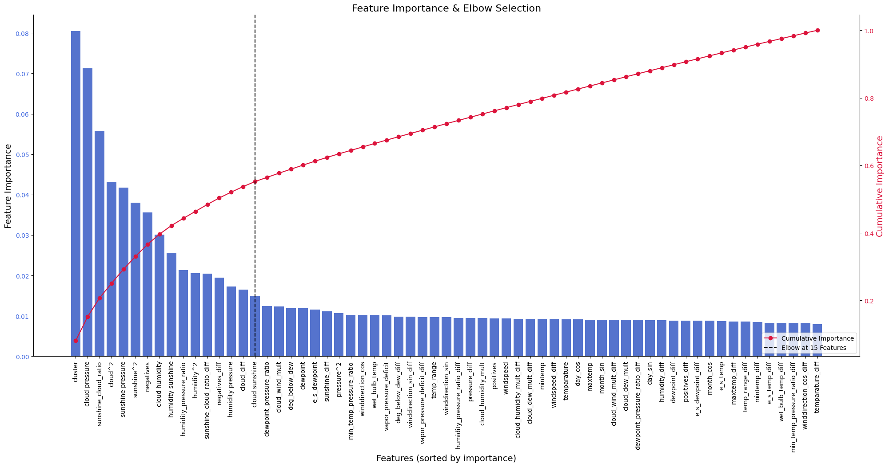

# **Rainfall Prediction – Kaggle Competition**  

## **Overview**  
This repository contains a pipeline for predicting daily rainfall probability based on a dataset derived from the **Rainfall Prediction using Machine Learning** dataset. The dataset has been synthetically generated using a deep learning model, with feature distributions that closely resemble but do not exactly match the original.  

## **Approach**  
The solution leverages extensive feature engineering and a well-structured machine learning pipeline to enhance predictive performance.  

### **Feature Engineering**  
- **Cyclic Encoding:** Converts periodic features into sine/cosine components for better continuity.  
- **Polynomial Expansion:** Captures non-linear interactions between features.  
- **Rolling Windows, Lag, & Difference Features:** Extracts temporal patterns and trends.  
- **Clustering-Based Features:** Uses K-means to extract intrinsic data structures as a feature.  
- **Feature Selection:** Uses an Extra Trees model to measure feature importance, with the **elbow method** determining the optimal number of features.  

### **Pipeline & Model Selection**  
- **Imbalanced Data Handling:** Applies **SMOTE** to mitigate class imbalance.  
- **Hyperparameter Optimization:** Utilizes **Randomized Search Cross-Validation** to fine-tune multiple classification models.  
- **Automated Submission:** The best-performing model is saved with predictions formatted for submission.  

## **Results**  
- **Cross-Validation ROC-AUC:** **0.8908**  
- **Test ROC-AUC:** **0.8541**  

Despite strong performance, further improvements may be possible through alternative feature selection strategies, ensembling, or refining hyperparameter tuning.  

## **Usage**  
To reproduce results, execute the pipeline with the provided dataset and model configurations.  
